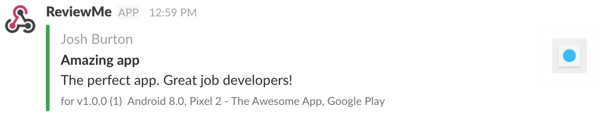

# ReviewMe

   

ReviewMe is a nodejs app that monitors App Store and Google Play reviews, and posts them to Slack.



This project was originally forked from [reviews-to-slack](https://www.npmjs.com/package/reviews-to-slack)


## Installation

`npm install -g @trademe/reviewme`

## Usage

`reviewme ~/myappsconfig.json`

## Config

ReviewMe requires a config file. A simple config looks something like:

```json
{
  "slackHook": "https://hooks.slack.com/services/01234/5678",
  "verbose": true,
  "dryRun": false,
  "interval":300,
  "apps": [
    {
      "appId": "com.myandroidapp",
      "publisherKey": "~/publisher.json"
    },
    {
      "appId": "012345678",
      "regions": [
              "nz",
              "us"
      ]
    }
  ]
}
```
### Options
* **slackHook**: The slack hook for your Slack integration. Reviews will be posted here.
* **verbose**: When enabled, log messages will be printed to the console
* **dryRun**: When enabled, ReviewMe will post the latest app review for each app on startup. Useful for debugging
* **botIcon** An image url to use for the bot avatar
* **showAppIcon** Determines if app icon will be displayed (overrides botIcon)
* **channel** Overrides the default Slack channel messages will be posted to
* **interval** The interval (in seconds) to check for new reviews. Default: 300.
* **cronStyleSchedule** CronJob style schedule to check for new reviews(Can be used instead of interval). Default: `00 * * * *`.
* **apps** A list of apps to fetch reviews for. See App Options below
* **publisherKey** *Android Only* The path to a Google Play Publisher private key (`.json` file). Used for accessing the Google Play Publisher API.

### App options
Note: Some options override the global configuration

* **appId** The Android app package name, or the iOS app ID.
* **regions** *iOS Only* The [ISO 3166-2](https://en.wikipedia.org/wiki/ISO_3166-2#Current_codes) regions to fetch reviews for (use `false` to include all regions)
* **botIcon** An image url to use for the bot avatar
* **showAppIcon** Determines if app icon will be displayed (overrides botIcon)
* **channel** Overrides the default Slack channel messages will be posted to


## Google Play Publisher Key
ReviewMe requires access to the Google Play Publisher API to fetch reviews. You need to supply ReviewMe with a Google Play Publisher API private key:

* Go to the Google Play Developer Console -> Settings -> API Access
* Create a Google Play Android Developer project
* Create a Service Account with "Service Accounts" -> "Service Account User" role
* Download the private key (`.json`)
* Supply the path to the private key in the `config.json`

 


